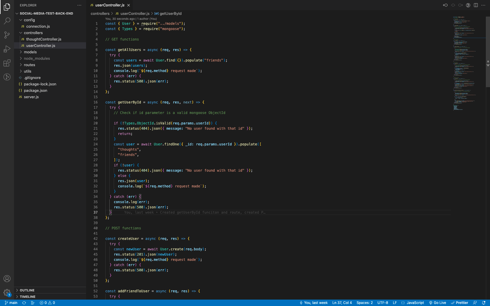

# Social Media Test Backend



## Description

This is a backend server that is recreating a basic social media app. It has a working RESTful api utilizes mongodb and mongoose as the ORM.

Concepts applied to this project include:

- Correct express modular routing
- Using mongoose to create Schemas for Mongo database
- Using mongoose to query the database

_Link to Walkthrough video:_ [Walkthrough Video]()

## Table of Contents

- [Installation](#installation)
- [Usage](#usage)
- [How to Contribute](#how-to-contribute)
- [Test](#test)
- [Questions](#questions)

## Installation

Run the seed data

```bash
npm run seed
```

Start the server

```bash
npm run dev
```

## Usage

Once server is started, use insomnia, postmates, or browser to put in requests to the api

## How to Contribute

N/A

## Test

N/A

## Questions

Github: https://www.github.com/jaredstaples50<br>
Email: jstaplesmusic@gmail.com
